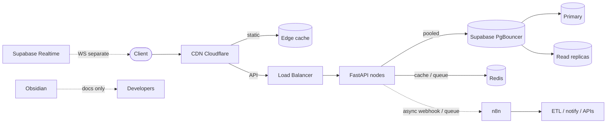

# RAGNAR scalable architecture (100k concurrent viewers)

This document is the **source of truth** for how RAGNAR components relate.
All new code, workflows, and diagrams must follow this map.

## System map (enforced)

```
Client
  │
  ▼
CDN (Cloudflare) ──► static assets (edge cache)
  │
  ▼ API traffic only
Load Balancer + DDoS / rate limits
  │
  ▼
FastAPI nodes (stateless, horizontally scaled)
  │
  ├──► Supabase Postgres via PgBouncer (transaction pooler)
  │       ├── primary  → writes / transactional reads
  │       └── replicas → heavy read traffic
  │
  ├──► Redis (optional but recommended)
  │       ├── response cache
  │       └── async job queues
  │
  └──► n8n  (async only: webhook / queue / background task)
          └── ETL, notifications, external APIs, schedules

Supabase Realtime ──► separate websocket layer (not via FastAPI)

Obsidian ──► developer docs / content specs / workflow definitions only
             (never a runtime dependency; publish = pre-generate or cache)
```



## Rules

### 1. FastAPI is stateless
- No in-memory sessions shared across requests (auth tokens live in cookies/JWT or Redis).
- Prefer **Supabase JWTs** (`Authorization: Bearer`) for multi-node auth.
- Cookie sessions remain supported for legacy storefront clients but must hit a shared store (DB), never process RAM.
- Async endpoints wherever I/O-bound.
- Deploy behind a load balancer with horizontal autoscaling.

### 2. Supabase through a connection pool
- Always use Supabase **PgBouncer** (Session pooler `:5432` or Transaction pooler `:6543`).
- Never open unbounded direct connections to `db.<ref>.supabase.co:5432` from app nodes at scale.
- Engine pool sized for pooler mode (small `pool_size` / `NullPool` in transaction mode).
- Heavy reads → `DATABASE_READ_URL` (replica) when configured.
- Realtime stays on Supabase Realtime; do not multiplex transactional queries over the same websocket path.

### 3. n8n is never in the hot path
- FastAPI **must not wait** for n8n to finish a workflow.
- Communication: fire-and-forget webhooks, Redis queues, or FastAPI `BackgroundTasks`.
- n8n owns: ETL, notifications fan-out, external API orchestration, scheduled jobs.

### 4. Obsidian is not a runtime dependency
- Docs, content specs, workflow definitions only.
- Published content must be pre-generated or cached (Counsel knowledge lives in Postgres; vault export is admin/async).

### 5. Frontend hits CDN first
- Static assets cached at the edge.
- API → LB → FastAPI.
- Cloudflare (or equivalent) rate limiting + DDoS protection enabled.

### 6. High-traffic endpoints are cached
- Redis (preferred) or short TTL in-process fallback for single-node dev.
- Explicit invalidation keys (e.g. `listings:*`, `meta`, `founding:status`).

## Component ownership

| Concern | Owner |
|---|---|
| HTTP API / business rules | FastAPI |
| Auth identity + Postgres + Storage + Realtime WS | Supabase |
| Workflow automation | n8n (async) |
| Human docs / vault | Obsidian |
| Edge cache / DDoS / TLS | CDN + LB |
| Hot-path cache + queues | Redis |

## Code generation checklist

- [ ] FastAPI handlers are stateless and safe behind N replicas
- [ ] DB URL uses pooler; queries are indexed; no N+1
- [ ] n8n calls are async / queued (never `await` workflow completion on the request path)
- [ ] Obsidian not imported on public request paths
- [ ] Diagrams match the system map above
