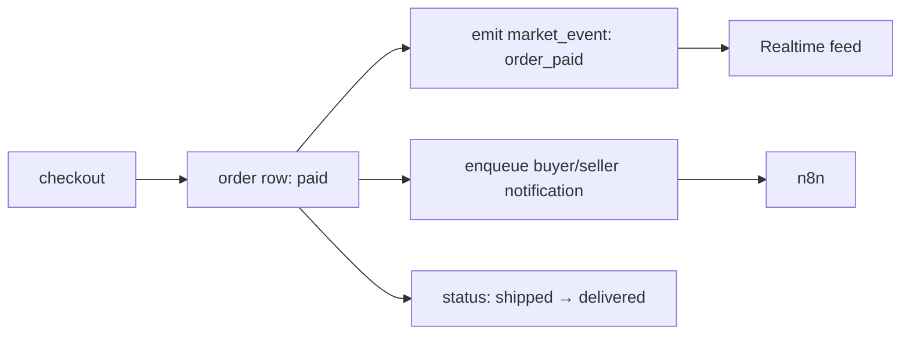

# Service Flow Diagrams

## Before — dual-write (lossy)

```
request → product router → SQLModel/SQLite (truth)
                        └→ market_bridge → Supabase REST (cards/listings/orders)  ← lossy copy
                        └→ enqueue_job → n8n
```

Two writes, two schemas, uuid5-hashed id bridge. Only commerce mirrored; sellers,
disputes, support, social, rides never copied → permanent drift.

## After — single-write + emit

```
request → product router → SQLModel/Supabase Postgres (single truth)
                        └→ emit event → market_events / realtime_events (firehose)
                        └→ enqueue_job → Redis → n8n
```

One durable write. The firehose is telemetry, not a second copy
([[Database Architecture/Telemetry Schema Explanation]]).

## Order lifecycle (after)



`market_bridge.mirror_*` becomes `emit_*`: it stops calling
`supabase_rest.insert("cards"/"listings"/"orders")` and keeps only the event +
`enqueue_job`. Best-effort, never in the hot path.

Related: [[Backend Architecture/Event Firehose Map]] · [[Evergreen/Async Boundary]] · [[Skills/Dual-Write Bridge]]
