# Relationship Diagrams

Foreign-key graph of the product schema (generated from SQLModel metadata). Integer PKs throughout; no UUID churn.

```mermaid
erDiagram
    user ||--o{ communitygroup : created_by_user_id
    user ||--o{ follow : user_id
    seller ||--o{ follow : seller_id
    seller ||--o{ listing : seller_id
    seller ||--o{ livestream : seller_id
    user ||--o{ notification : user_id
    user ||--o{ savedsearch : user_id
    user ||--o{ usersession : user_id
    user ||--o{ wantitem : user_id
    user ||--o{ cartitem : user_id
    listing ||--o{ cartitem : listing_id
    user ||--o{ collectionitem : user_id
    listing ||--o{ collectionitem : listing_id
    user ||--o{ conversation : user_id
    seller ||--o{ conversation : seller_id
    listing ||--o{ conversation : listing_id
    seller ||--o{ feedpost : seller_id
    listing ||--o{ feedpost : listing_id
    communitygroup ||--o{ groupmember : group_id
    user ||--o{ groupmember : user_id
    communitygroup ||--o{ groupthread : group_id
    user ||--o{ groupthread : author_user_id
    listing ||--o{ inventoryhold : listing_id
    user ||--o{ inventoryhold : buyer_user_id
    user ||--o{ livestreamreminder : user_id
    livestream ||--o{ livestreamreminder : stream_id
    listing ||--o{ offer : listing_id
    seller ||--o{ offer : seller_id
    user ||--o{ offer : buyer_user_id
    listing ||--o{ order : listing_id
    seller ||--o{ order : seller_id
    user ||--o{ order : buyer_user_id
    seller ||--o{ ride : seller_id
    listing ||--o{ ride : listing_id
    listing ||--o{ sale : listing_id
    user ||--o{ watchitem : user_id
    listing ||--o{ watchitem : listing_id
    ride ||--o{ bid : ride_id
    user ||--o{ bid : bidder_user_id
    conversation ||--o{ chatmessage : conversation_id
    order ||--o{ dispute : order_id
    user ||--o{ dispute : opened_by_user_id
    order ||--o{ feedback : order_id
    seller ||--o{ feedback : seller_id
    user ||--o{ feedback : rater_user_id
    ride ||--o{ giveaway : ride_id
    groupthread ||--o{ groupcomment : thread_id
    user ||--o{ groupcomment : author_user_id
    ride ||--o{ rideevent : ride_id
    user ||--o{ supportconversation : user_id
    order ||--o{ supportconversation : order_id
    giveaway ||--o{ giveawayentry : giveaway_id
    user ||--o{ giveawayentry : user_id
    supportconversation ||--o{ supportauditlog : conversation_id
    user ||--o{ supportauditlog : user_id
    order ||--o{ supportauditlog : order_id
    supportconversation ||--o{ supportmessage : conversation_id
    order ||--o{ supportrefund : order_id
    supportconversation ||--o{ supportrefund : conversation_id
```

Telemetry tables have **no** FKs into this graph by design ([[Database Architecture/Telemetry Schema Explanation]]).

Up: [[Database Architecture/40-Table Schema Overview]]
