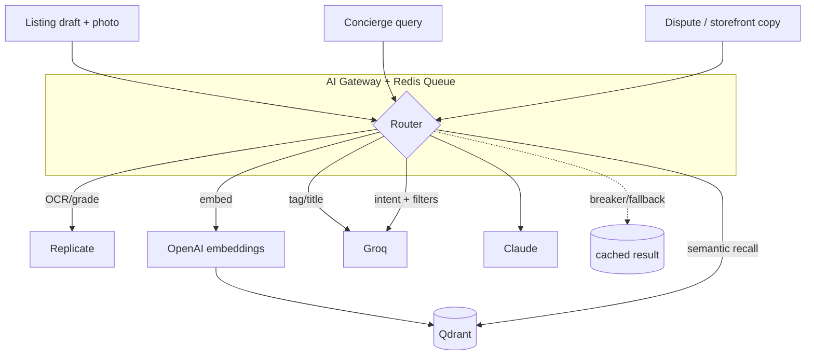

# 🧠 AI Layer — Claude + Groq + Qdrant + OpenAI embeddings

Back to [[RAGNARIPS-MASTER]] · Related: [[RAG/README|RAG]], [[Backend/README|Backend]], [[Stability/README|Stability]].

## Principle
All AI calls go through a single **AI Gateway** (own service, queue-backed, rate-limited, with circuit breakers + fallbacks). Nothing calls a provider inline in a user request path unless it's interactive and fast.

## Model router
| Task | Model | Why |
|---|---|---|
| Tagging, autocomplete, short summaries, feed blurbs | **Groq Llama 3.1 70B** | fast + cheap, high volume |
| Pricing rationale, dispute/"Counsel" reasoning, storefront copy, structured extraction | **Claude 3.5 Sonnet** | quality + tool use |
| Hardest edge cases / long-context | **Claude 3.5 Opus** | max reasoning |
| Embeddings | **OpenAI** (`text-embedding-3-small`) | → [[RAG/README|Qdrant]] |
| Card grading + OCR | **Replicate** | see [[LiveSelling/README|Image AI]] |

## Pipelines


## Enrichment pipeline (listing)
1. `POST /api/listings` creates draft → enqueue `enrich(listing_id)`.
2. Worker: Replicate OCR + grade estimate → structured fields.
3. Groq: generate title/tags/category from OCR text.
4. OpenAI embed → upsert vector to Qdrant (`listings` collection).
5. `UPDATE listing` with enrichment; notify seller.

## Gateway contract
```python
# ai_gateway.py
async def run(task: str, payload: dict) -> dict:
    model = ROUTER[task]                 # groq | claude | opus
    await ratelimit(model)               # Redis token bucket
    try:
        return await CALL[model](payload) # httpx, timeout + retry
    except ProviderError:
        return await FALLBACK[task](payload)  # cheaper model or cached
```

## Rate limits / isolation
- Per-provider token buckets in Redis; queue depth drives worker autoscale.
- Circuit breaker per provider; on trip → fallback chain Claude→Groq→cache.
- Cost + latency metrics exported to [[Stability/README|Prometheus]].

## Planned docs
- `Model-Router.md`, `Prompts/` library, `Cost-Budget.md`, `Eval-Harness.md`.

## Change log
- 2026-07-22 — initial AI layer, router, enrichment pipeline.
