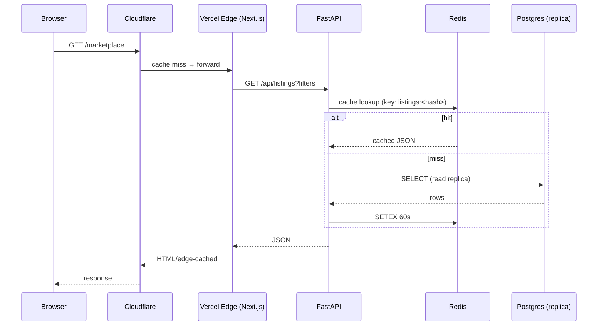
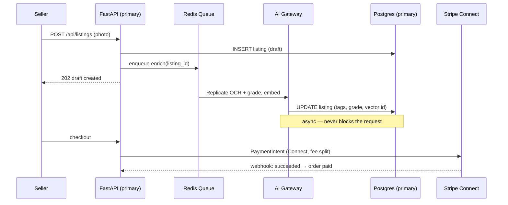

# 🗺️ System Overview & Data Flow

Back to [[RAGNARIPS-MASTER]].

## Request lifecycle (read path)

## Write path (with AI + payments)

## Scaling paths
- **Stateless API** → N replicas behind Cloudflare LB; scale on CPU + p95 latency.
- **LiveKit** → separate auto-scaling group; scale on concurrent participants; sticky by room.
- **AI Gateway** → own service + queue; scale workers on queue depth; provider rate-limits enforced here.
- **DB** → writes to primary, reads to replicas via PgBouncer; cache absorbs hot reads.

## Weaving rule
No subsystem talks to the DB or an AI provider directly except through its owning service:
`Frontend → API → (Redis | Postgres | AI Gateway | LiveKit | Stripe)`. Keep this invariant.

## Planned deep-dive docs
- `Data-Flow-Detailed.md`, `Scaling-Playbook.md`, `Failure-Modes.md` (on request)

## Change log
- 2026-07-22 — initial overview + read/write/scaling diagrams.
