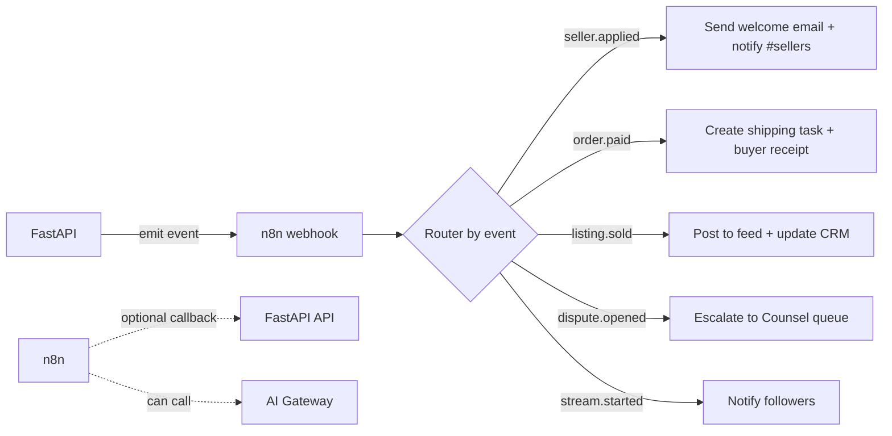

# 🔁 Automation — n8n

Back to [[RAGNARIPS-MASTER]] · Related: [[Backend/README|Backend]], [[AI/README|AI]], [[KnowledgeBase/README|Knowledge Base]].

## The rule (read this first)
**Do not vendor the cloned n8n monorepo into the app.** The clone at
`C:\Users\Hreil\OneDrive\Documents\GitHub\n8n` is the *source of n8n itself*. Ragnarips runs n8n as a **service** and integrates over webhooks:

```bash
docker run -d --name n8n -p 5678:5678 \
  -e N8N_HOST=n8n.ragnarips.com -e WEBHOOK_URL=https://n8n.ragnarips.com/ \
  -v n8n_data:/home/node/.n8n docker.n8n.io/n8nio/n8n
```
(For prod, put it behind Cloudflare with Postgres as n8n's own DB.)

## Role in the architecture
n8n is the **side-effect orchestrator** — it keeps business workflows (emails, pings, CRM, follow-ups) OUT of the FastAPI request path. FastAPI emits an event; n8n does the rest as a visual workflow you can edit without deploys.



## Integration (already wired, key-gated)
`app/config.py` → `N8N_WEBHOOK_BASE`, `N8N_WEBHOOK_SECRET`, `settings.automation_enabled`.
`app/automation.py` → `await emit(event, payload)`:
- No-op if `N8N_WEBHOOK_BASE` unset.
- Fire-and-forget, 3s timeout, failures logged never raised.
- HMAC-signs the body with `N8N_WEBHOOK_SECRET` → header `X-Ragnar-Signature` (verify in n8n).

```python
from ..automation import emit
await emit("order.paid", {"order_id": order.id, "total_cents": total, "buyer": user.id})
```

## Event catalog (from `EVENTS` in automation.py)
`seller.applied` · `seller.founding_claimed` · `listing.created` · `listing.sold` · `order.paid` · `order.shipped` · `dispute.opened` · `stream.started`

## Emit points (wired — key-gated via `emit_bg`)
| Event | Where |
|---|---|
| `seller.applied` | `app/routers/founding.py`, `app/routers/sellers.py` |
| `seller.founding_claimed` | `app/routers/sellers.py` when founding slot granted |
| `listing.created` | `app/routers/listings.py` `_persist_listing` |
| `listing.sold` | manual sell + Stripe checkout completed |
| `order.paid` | Stripe webhook (`app/routers/payments.py`) — background thread |
| `stream.started` | `app/routers/streams.py` when status → live |

> Set `N8N_WEBHOOK_BASE` (+ optional secret) in Render to turn on. Unset = safe no-op.

## Security
- n8n verifies `X-Ragnar-Signature` (HMAC-SHA256 of body with the shared secret).
- n8n behind Cloudflare; webhook base not guessable; least-privilege creds in n8n credentials store.

## Stability
Emit is best-effort and off the request path. For guaranteed delivery later, route events through **Redis queue → worker → n8n** (retry/DLQ). Run the [[Stability-Checklist]] when wiring the payment event.

## Change log
- 2026-07-23 — wired `emit_bg` into founding/sellers/listings/payments/streams.
- 2026-07-22 — initial n8n subsystem; config + `automation.emit()` helper added (off by default).
