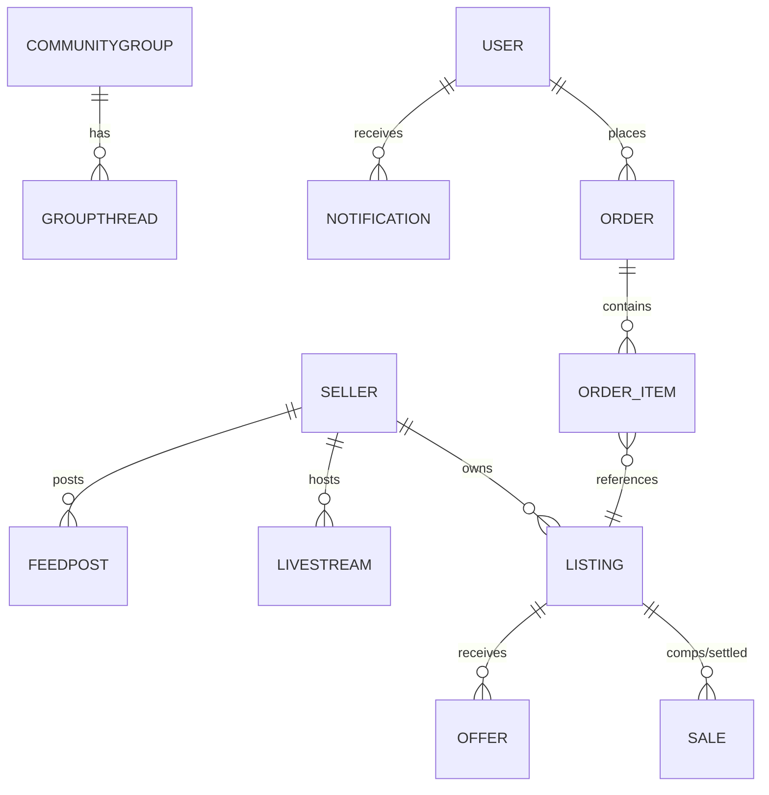

# ⚙️ Backend — FastAPI + Supabase + Redis + Stripe Connect

Back to [[RAGNARIPS-MASTER]] · Related: [[AI/README|AI]], [[Stability/README|Stability]], [[RAG/README|RAG]].

## Services
- **FastAPI** (keep current app) — stateless, horizontally scaled.
- **Supabase Postgres** — primary + read replicas, PgBouncer pooling.
- **Redis** — cache, rate-limit counters, pub/sub, job queues.
- **Stripe Connect** — seller onboarding, destination charges, fee split (5% / 4% founding).

## API surface (current routers → grouped)
> Source: `app/routers/*`. Kept as the canonical API into the target stack.

| Domain | Routes (prefix) | Notes |
|---|---|---|
| Auth | `/api/auth/*` | session cookie, verify email |
| Catalog/Listings | `/api/listings`, `/api/catalog` | search, filters, CRUD |
| Offers/Cart/Orders | `/api/offers`, `/api/cart`, `/api/orders` | checkout, fee logic |
| Payments | `/api/payments/*` | Stripe Connect + webhooks |
| Pricing/Comps | `/api/pricing`, comps | sold-price history |
| Sellers/Stores | `/api/sellers`, `/api/stores` | storefronts |
| Feed/Groups/Social | `/api/feed`, `/api/groups`, `/api/social` | community |
| Live/Rides/Streams | `/api/rides`, `/api/streams` | → LiveKit |
| Notifications/Watch | `/api/notifications`, `/api/watch` | |
| Media/Scan | `/api/media`, `/api/scan` | → Replicate/OCR |
| AI | `/api/ai/*`, `/api/admin/studio` | → AI Gateway |
| Support | `/api/support/*` | "Counsel" agent |
| Meta/SEO/Health | `/api/site-config`, `/api/seo`, `/health` | |

## Data model (core tables — from `app/models.py`)

Full column-level schema → planned `DB-Schema.md`.

## Fee logic (invariant)
- Standard platform fee **5%**; **Founding 250** sellers locked at **4% forever** (`founding_number` 1..250).
- Fee computed server-side at checkout; never trust client.

## Caching keys (Redis)
```
listings:<filter-hash>     TTL 60s
listing:<id>               TTL 300s
store:<handle>             TTL 300s
feed:home                  TTL 30s
ratelimit:<ip>:<route>     TTL window
site-config                TTL 300s (invalidate on Studio publish)
```

## Connection pooling snippet
```python
# db.py — Supabase Postgres via PgBouncer (transaction pooling)
from sqlmodel import create_engine
engine = create_engine(
    settings.database_url,           # supabase pooled URL :6543
    pool_pre_ping=True, pool_size=10, max_overflow=20,
)
```

## Planned docs
- `API-Routes.md` (request/response schemas), `DB-Schema.md`, `Payments-Connect.md`, `Redis-Keys.md`.

## Change log
- 2026-07-22 — initial backend map from current routers/models.
