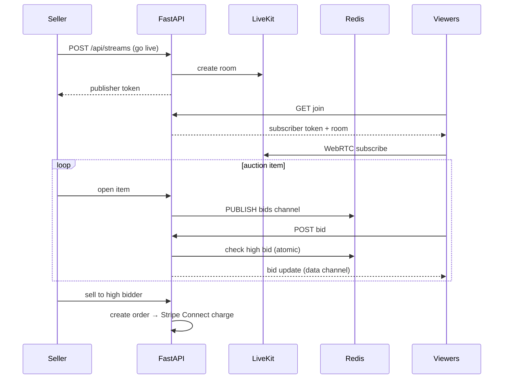

# 📡 Live Selling — LiveKit + Replicate Image AI

Back to [[RAGNARIPS-MASTER]] · Related: [[Backend/README|Backend]], [[AI/README|AI]].

## Components
- **LiveKit** SFU for WebRTC video + data channel chat. One room per break/auction.
- **Roles**: `seller` (publisher), `viewer` (subscriber), `moderator`. Backend mints scoped tokens.
- **Auction state** in Redis (pub/sub) for low-latency bids; settled via Stripe Connect.

## Current (repo)
- `config.py` has `LIVEKIT_URL/API_KEY/API_SECRET` **slots** (unset). `rides`/`streams` routers model the domain. This is the wiring target for Phase 4.

## Live break flow


## Token minting
```python
# livekit_tokens.py
from livekit import AccessToken, VideoGrant
def mint(room: str, identity: str, role: str) -> str:
    grant = VideoGrant(room_join=True, room=room,
                       can_publish=(role == "seller"),
                       can_subscribe=True,
                       can_publish_data=(role in ("seller","moderator")))
    return AccessToken(KEY, SECRET, identity=identity, grant=grant).to_jwt()
```

## Scaling
- LiveKit in its **own auto-scaling group**; scale on concurrent participants; sticky routing by room.
- Media never transits FastAPI — only signaling/tokens/auction state do.
- Viewer counts + bid latency → [[Stability/README|Prometheus]].

## Image AI (Replicate)
- On listing photo: OCR card text + grade estimate + optional upscale (`real-esrgan`). Feeds [[AI/README|enrichment pipeline]].

## Planned docs
- `Auction-Engine.md`, `LiveKit-Ops.md`, `Grading-Pipeline.md`.

## Change log
- 2026-07-22 — initial live selling + auction flow.
