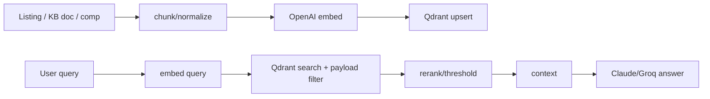

# 🔎 RAG / Vector Search — Qdrant + OpenAI embeddings

Back to [[RAGNARIPS-MASTER]] · Related: [[AI/README|AI]], [[KnowledgeBase/README|Knowledge Base]].

## Purpose
Semantic recall for: concierge card search ("find me a cheap graded Charizard vibe"), similar-listing recommendations, and knowledge/support answers (RAG over the [[KnowledgeBase/README|KB]]).

## Collections (Qdrant)
| Collection | Vector | Payload | Source |
|---|---|---|---|
| `listings` | 1536 (te-3-small) | listing_id, seller, category, price_cents, grade, status | listing enrichment |
| `sales_comps` | 1536 | category, set, player, sold_price, sold_at | sold history |
| `knowledge` | 1536 | doc_id, section, url | [[KnowledgeBase/README|KB]] |
| `stores` | 1536 | handle, tagline, categories | storefronts |

Distance: cosine. Payload-indexed on `category`, `status`, `price_cents` for filtered search.

## Ingest → query flow


## Query snippet
```python
# rag.py
async def semantic_listings(q: str, filters: dict, k: int = 24):
    vec = await embed(q)                       # OpenAI
    return qdrant.search(
        collection_name="listings", query_vector=vec, limit=k,
        query_filter=to_qdrant_filter(filters), # e.g. status=active, price<=X
    )
```

## Consistency rule
Every write that changes a listing/comp/KB doc **also** upserts (or deletes) its vector in the same worker job — no drift between Postgres and Qdrant.

## Planned docs
- `Embeddings.md`, `Reranking.md`, `Freshness-Jobs.md`.

## Change log
- 2026-07-22 — initial vector schema + ingest/query flow.
