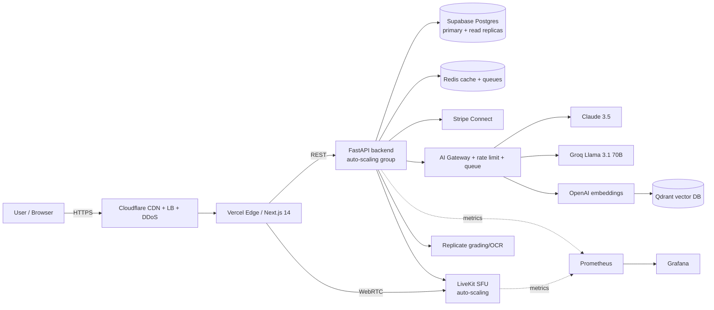

# 🏛️ Ragnarips Master Document

> **Single source of truth** for the Ragnarips trading-card marketplace architecture.
> Architect Mode is **permanent**. Every subsystem links back here.

## Sections
- [[System-Overview]] — the whole system, data flow, scaling paths
- [[Frontend/README|Frontend]] · [[Backend/README|Backend]] · [[AI/README|AI Layer]]
- [[LiveSelling/README|Live Selling]] · [[Stability/README|Stability]]
- [[RAG/README|RAG / Vector DB]] · [[KnowledgeBase/README|Knowledge Base]] · [[Automation/README|Automation (n8n)]]
- [[Backend/Supabase-Integration|Supabase Integration]]
- [[Roadmap/README|Roadmap]] · [[Stability-Checklist]]

---

## 1. Target Stack (the Game Plan)

| Layer | Technology | Purpose |
|---|---|---|
| **Frontend** | Next.js 14 (App Router), Tailwind, ShadCN, Vercel Edge | UI, SSR/edge rendering, SEO |
| **Backend** | FastAPI, Supabase (Postgres), Redis, Stripe Connect | API, data, cache, payments/payouts |
| **AI** | Claude 3.5 Sonnet/Opus, Groq Llama 3.1 70B, Qdrant, OpenAI embeddings | reasoning, fast inference, vector search |
| **Live Selling** | LiveKit (WebRTC video + chat) | real-time breaks/auctions |
| **Image AI** | Replicate (grading + OCR) | card recognition, condition, upscaling |
| **Automation** | n8n (self-host via docker) | side-effect workflows: emails, notifications, CRM, follow-ups |
| **Edge/Infra** | Cloudflare CDN + LB + DDoS, auto-scaling groups | delivery, protection, elasticity |
| **Observability** | Grafana + Prometheus | metrics, alerting, SLOs |

## 2. Current State vs Target (the honest gap)

| Concern | Current (in repo) | Target | Status |
|---|---|---|---|
| Frontend | Static HTML/JS + `nav.js` injected shell | Next.js 14 + ShadCN | 🔴 rebuild |
| API | FastAPI + SQLModel | FastAPI (keep) | 🟢 keep |
| DB | SQLite (dev) / Postgres via Alembic | Supabase Postgres + replicas | 🟡 migrate — clone + config ready, see [[Backend/Supabase-Integration]] |
| Cache | none | Redis | 🔴 add |
| Automation | none | n8n webhooks | 🟡 config + `automation.emit()` helper added, off until wired ([[Automation/README]]) |
| Payments | Stripe (`stripe` sdk, key-gated) | Stripe Connect | 🟡 extend |
| LLM | OpenAI vision + Claude via HTTP (`app/ai.py`) | Claude + Groq router | 🟡 formalize |
| Vector search | none | Qdrant + OpenAI embeddings | 🔴 add |
| Live video | LiveKit **config slots only** (`config.py`) | LiveKit wired | 🔴 wire |
| Image AI | Replicate **config slots** (`recognition.py`) | Replicate grading+OCR | 🟡 wire |
| Edge/CDN | Render + direct | Cloudflare + Vercel Edge | 🔴 add |
| Monitoring | logs only | Grafana + Prometheus | 🔴 add |

Legend: 🟢 keep · 🟡 evolve · 🔴 net-new. Full sequencing in [[Roadmap/README|Roadmap]].

## 3. System at a Glance

## 4. Stability Plan (summary)
- **Horizontal scaling** for FastAPI + LiveKit via auto-scaling groups (stateless API; sticky WebRTC).
- **Cloudflare** in front: CDN cache, load balancing, DDoS/WAF.
- **Redis** for hot reads (listings, feed, sessions), rate-limit counters, and job queues.
- **Supabase** read replicas + PgBouncer connection pooling; writes to primary only.
- **AI isolation**: dedicated AI Gateway service, per-provider rate limits, async queues, circuit breakers + fallbacks (Claude → Groq → cached).
- **Observability**: Prometheus scrape + Grafana dashboards, SLOs, alerting.
- Every new feature must pass the [[Stability-Checklist]].

## 5. AI Integration Plan (summary)
- **Router** picks the model by task: Groq (fast/cheap: tagging, autocomplete, summaries) vs Claude (deep: pricing rationale, dispute resolution, storefront copy).
- **Embeddings** (OpenAI) → **Qdrant** collections for semantic card/listing/knowledge search → powers concierge + RAG.
- **Image AI** (Replicate) for grading estimate + OCR of card text → structured listing fields.
- All AI calls flow through the queue-backed gateway (never inline in request path when avoidable). See [[AI/README]].

## 6. Live Selling System (summary)
- **LiveKit** rooms per break/auction; roles: seller (publisher), viewers (subscribers), moderator.
- Backend mints LiveKit tokens, tracks viewer counts, drives auction state via Redis pub/sub, settles via Stripe Connect. See [[LiveSelling/README]].

## 7. Marketplace Logic (summary)
- Listings (raw/graded), search + filters, offers, cart, orders, sold-comps history, seller fees (5% standard / 4% founding 250).
- Social **Feed**, **Groups**, seller **Stores**, **AI storefront generation**. See [[Backend/README]].

## 8. Long-Term Roadmap (summary)
Phase 0 harden current → Phase 1 Supabase+Redis → Phase 2 Next.js frontend → Phase 3 AI gateway+Qdrant → Phase 4 LiveKit → Phase 5 Cloudflare+observability+auto-scaling. Detail in [[Roadmap/README]].

---
_Change log lives at the bottom of each subsystem doc. Update `updated:` on every edit._
