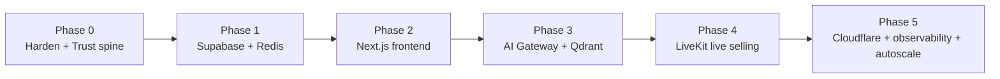

# 🗺️ Roadmap — Current → Target

Back to [[RAGNARIPS-MASTER]]. Product sequencing (beat Whatnot): [[Success-Blueprint]].
Trust spine: [[TrustSafety/README]]. Infra phases below stay valid; Wave 0 trust runs **inside** Phase 0.

## Phase 0 — Harden current + Trust spine (now)
- Keep FastAPI; tests green; env/secrets clean. Confirm Stripe live path.
- **Trust spine:** seller verification states, fraud score, suspend/ban enforcement, TrustEvent audit, buyer-protection KB.
- **Exit:** stable prod on Render; ops can suspend a bad seller and block new listings/checkout in one action.

## Phase 1 — Data + Cache + Automation
- Migrate Postgres → **Supabase** (hosted, or self-host via the clone's `supabase/docker/`); add read replica + PgBouncer. Guide: [[Backend/Supabase-Integration]].
- Introduce **Redis**: cache keys ([[Backend/README|Backend]]), rate limits.
- Stand up **n8n** (docker `n8nio/n8n`); wire first events (`seller.applied`, then `order.paid` carefully) via `automation.emit()`. Guide: [[Automation/README]].
- **Exit:** p95 read latency down; cache hit ratio > 70% on listings/feed; first n8n workflow live (welcome email on seller.applied).

## Phase 2 — Frontend rebuild
- Stand up **Next.js 14 + ShadCN** on Vercel Edge; port routes ([[Frontend/README|Frontend]]).
- Keep FastAPI as API; strangler pattern page-by-page.
- **Exit:** marketplace + store + listing on Next.js; legacy static retired.

## Phase 3 — AI Gateway + Vector
- Build **AI Gateway** (router, queue, rate limits, fallbacks) — [[AI/README|AI]].
- Add **Qdrant** + OpenAI embeddings; wire concierge + RAG — [[RAG/README|RAG]].
- **Exit:** all AI calls via gateway; semantic search live.

## Phase 4 — Live selling
- Wire **LiveKit** (tokens, rooms, auction engine over Redis) — [[LiveSelling/README|Live]].
- **Exit:** a real live break with bids + Stripe Connect settlement.

## Phase 5 — Edge + Ops
- **Cloudflare** CDN/LB/WAF; **auto-scaling groups**; **Grafana + Prometheus** — [[Stability/README|Stability]].
- **Exit:** SLOs met under load test at 3× peak.

## Backlog / bottlenecks to watch
- Search relevance (rerank), AI cost ceiling, image pipeline throughput, webhook idempotency, replica lag.

## Change log
- 2026-07-23 — Phase 0 includes Trust spine; link Success Blueprint.
- 2026-07-22 — initial phased roadmap.
