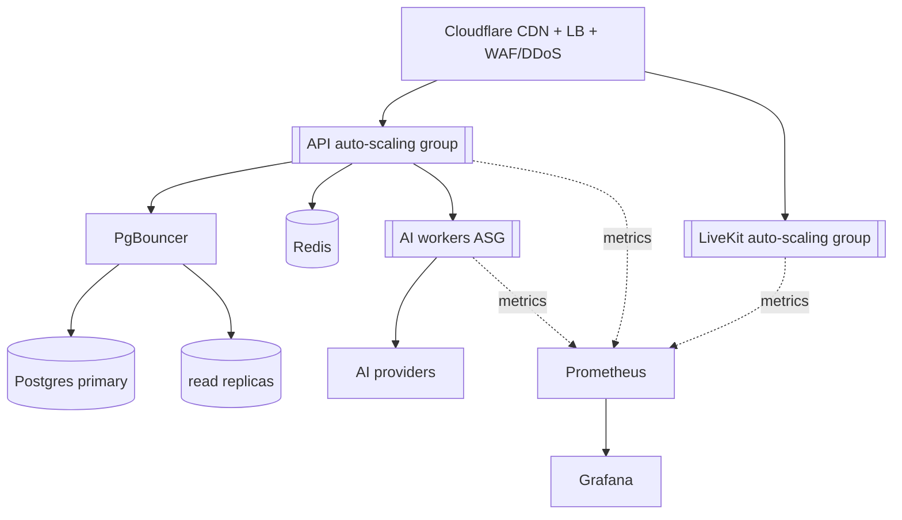

# 🛡️ Stability Blueprint

Back to [[RAGNARIPS-MASTER]] · See [[Stability-Checklist]].

## Pillars
1. **Horizontal scaling** — stateless FastAPI in auto-scaling groups; LiveKit in its own group.
2. **Cloudflare edge** — CDN cache, load balancer, DDoS/WAF in front of everything.
3. **Redis** — cache hot reads, rate-limit counters, queues, pub/sub.
4. **Supabase** — read replicas + PgBouncer pooling; writes → primary only.
5. **AI isolation** — dedicated gateway, per-provider rate limits, queues, circuit breakers + fallbacks.
6. **Observability** — Prometheus scrape + Grafana dashboards + alerting + SLOs.
7. **Auto-scaling** — backend on CPU/p95; LiveKit on participants; AI workers on queue depth.

## Topology

## SLOs (initial targets)
| Metric | Target |
|---|---|
| API p95 latency | < 300 ms (cached < 80 ms) |
| API availability | 99.9% |
| Live join time | < 2 s |
| AI interactive p95 | < 4 s (else async) |
| Error rate | < 0.5% |

## Key dashboards (Grafana)
- API: RPS, p50/p95/p99, 5xx, saturation.
- DB: connections, replica lag, slow queries.
- Redis: hit ratio, evictions, queue depth.
- AI: provider latency, error/fallback rate, cost/hr.
- LiveKit: rooms, participants, egress bandwidth.

## Failure modes & responses
- **DB primary down** → reads from replica (degraded write); alert.
- **AI provider down** → circuit breaker → fallback chain → cache.
- **Redis down** → bypass cache (DB direct), rate-limit fails-open with cap; alert.
- **Traffic spike/DDoS** → Cloudflare absorbs; ASGs scale; queues buffer AI.

## Planned docs
- `Runbooks/`, `SLO-Dashboards.md`, `Load-Testing.md`, `DR-Plan.md`.

## Change log
- 2026-07-22 — initial blueprint, topology, SLOs.
