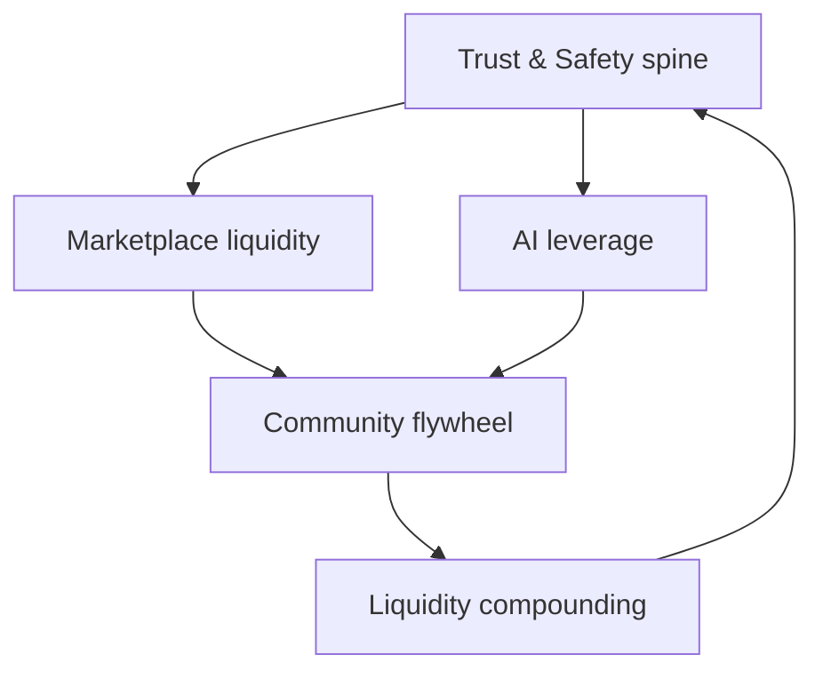

# 🚀 Ragnarips Success Blueprint

> **Win three arenas at once.** Whatnot wins on live liquidity + community habit.
> Ragnarips beats them on **trust density**, **card-native AI**, and **creator economics** —
> without shipping a half marketplace that dies to fraud or churn.

Back to [[RAGNARIPS-MASTER]]. Trust detail: [[TrustSafety/README|Trust & Safety]].

---

## Core takeaway

Most startups build one of:

1. **Marketplace mechanics** (trust, liquidity, seller tools)
2. **AI infrastructure** (recs, fraud, pricing, live tools)
3. **Community flywheel** (identity, retention, creator economics)

Ragnarips must ship **all three**, sequenced so trust never lags GMV.

---

## Honest gap — repo today vs required to beat Whatnot

| Arena | Capability | Status in repo | Priority |
|---|---|---|---|
| Trust | Verified sellers / ID | 🟡 schema + admin APIs landing (this blueprint) | P0 |
| Trust | Fraud scoring | 🟡 heuristic scorer + events | P0 |
| Trust | Suspension / ban | 🟡 trust_status enforced on list + checkout | P0 |
| Trust | Buyer protection + disputes | 🟢 open/resolve dispute, Counsel | P0 polish |
| Trust | Chargeback desk | 🔴 Stripe dispute webhooks + playbooks | P1 |
| Payments | Stripe Connect split + fee | 🟢 destination charges | keep |
| Payments | Escrow / delayed payout | 🔴 hold periods by risk tier | P1 |
| Payments | 1099-K / tax | 🔴 Stripe Tax + reporting export | P2 |
| Inventory | Structured listings + CSV | 🟢 | keep |
| Inventory | AI image cleanup / grading suggest | 🟡 Cloudinary + recognition seams | P1 |
| Seller tools | Analytics / coupons / show templates | 🔴 | P2 |
| AI | Scan-to-post + comps | 🟢 | keep |
| AI | Semantic search / vectors | 🔴 Qdrant (roadmap Phase 3) | P2 |
| AI | Rec engine | 🔴 | P2 |
| AI | Live card recognition + comps overlay | 🔴 after LiveKit | P3 |
| Live | Rides auction state machine | 🟢 | keep |
| Live | Real WebRTC at scale | 🟡 LiveKit tokens only | P3 |
| Community | Feed / groups / follows | 🟢 | keep |
| Community | XP / badges / streaks | 🔴 | P3 |
| Legal | Privacy + ToS pages | 🟡 static privacy exists | P1 |
| Legal | Seller agreement + insurance | 🔴 | P1 |

Legend: 🟢 shipped · 🟡 partial · 🔴 missing

---

## Sequencing (do not skip)

### Wave 0 — Trust spine (NOW)
Ship before scaling paid acquisition or big seller pushes.
- Verification states + ID verification hook (Stripe Identity / Persona)
- Fraud score + TrustEvent audit log
- Suspend / restrict / ban with listing + checkout enforcement
- Dispute SLAs + buyer-protection KB for Counsel
- Chargeback / Stripe `charge.dispute.*` handling (next slice)

**Exit:** bad sellers can be stopped in minutes; buyers see a trust badge; every trust action is audited.

### Wave 1 — Marketplace liquidity
- Escrow / payout delay by risk tier
- Seller onboarding checklist (payouts → first listing → first sale)
- Watchlist alerts + “seller went live” notifications (extend streams)
- Multi-item cart checkout path

**Exit:** a new seller can go from apply → paid sale without staff babysitting.

### Wave 2 — AI leverage (card-native moat)
- AI Gateway + embeddings + Qdrant ([[AI/README]], [[RAG/README]])
- Semantic + image “find similar”
- Dynamic price suggest from comps (extend `sales` / `pricing`)
- Seller coaching signals (title, bid, thumbnail, retention)

**Exit:** discovery and pricing feel smarter than Whatnot for cards specifically.

### Wave 3 — Live leapfrog
- Wire LiveKit rooms to rides ([[LiveSelling/README]])
- Real-time chat moderation + price comps overlay
- Auto overlays / show scripts (after reliable video)

**Exit:** one production live break with bids + settlement.

### Wave 4 — Community flywheel
- Creator referral bonuses + spotlight pages
- Loyalty / badges / seasonal challenges
- Daily drops + weekly events calendar

**Exit:** retention loops that do not require paid ads to refill the funnel.

---

## Secret sauce (non-obvious)

1. **Identity-based personalization** — treat each buyer as a collector with a category story, not a session cookie.
2. **Gamification that respects the hobby** — XP for authentic collecting behavior (not spam bids).
3. **AI seller coaching** — teach shows; Whatnot leaves sellers to sink.
4. **Buyer magnets** — price alerts, watchlist, auto-bid, live-notify (partially present as watch + stream reminders).

---

## What to build next (menu → ordered)

| Choice | When | Deliverable |
|---|---|---|
| **Trust & safety blueprint** | First (this PR) | [[TrustSafety/README]] + enforceable seller trust spine |
| Seller onboarding system | Immediately after Wave 0 | Checklist API + mystore UX + automation events |
| Full AI architecture | Parallel to Wave 1 data plane | Expand [[AI/README]] + gateway stubs |
| Marketplace feature roadmap | Continuous | This doc + [[Roadmap/README]] |

---

## Change log
- 2026-07-23 — initial success blueprint from beat-Whatnot requirements; Wave 0 trust spine started in code.
