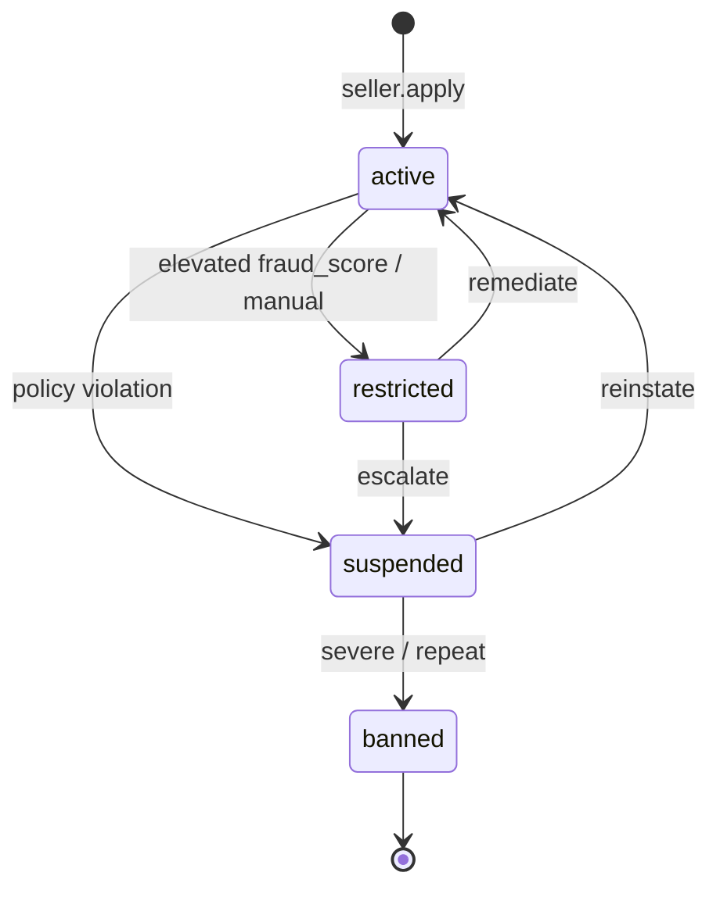

# 🛡️ Trust & Safety Blueprint

> Trust is the product ([[Evergreen/Trust as Product]]). This doc is the operating system
> for verified sellers, fraud scoring, suspensions, disputes, and chargebacks.

Parent: [[Success-Blueprint]] · Master: [[RAGNARIPS-MASTER]]

---

## 1. Goals

1. **Buyers** know who they are dealing with (badge + protection policy).
2. **Sellers** get clear rules and fast reinstatement paths when they comply.
3. **Ops** can suspend, restrict, or ban in one action with a full audit trail.
4. **AI (Counsel)** applies the same policies humans do — no improvisation.

---

## 2. Capability map

| Capability | Spec | Code |
|---|---|---|
| Verified sellers | `verification_status`: unverified → pending → verified \| rejected | `Seller` + `/api/admin/trust/*` |
| ID verification | External ref (`id_verification_ref`) for Stripe Identity / Persona | hook field; provider wire P1 |
| Fraud scoring | 0–100 risk score; higher = riskier | `app/trust.py` heuristic |
| Trust status | `active` \| `restricted` \| `suspended` \| `banned` | enforced on list + checkout |
| Audit log | `TrustEvent` rows for every trust action | `trust_event` table |
| Buyer protection | Dispute open/resolve + Counsel policy | `orders` + `support` |
| Seller suspension | Admin suspend/reinstate; listings blocked | admin trust APIs |
| Chargebacks | Stripe dispute webhooks → auto-score + queue | **P1 backlog** |
| Escrow / hold | Delay payouts by risk tier | **P1 backlog** |

---

## 3. Trust status machine

| Status | Can list? | Can receive checkout? | Can go live (rides)? |
|---|---|---|---|
| `active` | ✅ | ✅ | ✅ |
| `restricted` | ❌ | ✅ existing inventory only | ❌ |
| `suspended` | ❌ | ❌ | ❌ |
| `banned` | ❌ | ❌ | ❌ |

---

## 4. Fraud score (v1 heuristic)

Inputs (weighted; recompute on dispute / feedback / admin action):

| Signal | Weight | Notes |
|---|---|---|
| Open disputes | +15 each (cap +45) | from `Dispute.status=open` |
| Denied-refund disputes (seller favored) | −5 each (floor 0) | good signal |
| Refund resolutions | +10 each (cap +30) | buyer won |
| Low star feedback (≤2) | +8 each (cap +24) | last 90 days |
| Verified seller | −10 | once |
| Stripe charges enabled | −5 | once |
| Manual admin adjustment | ±N | via TrustEvent |

**Thresholds (ops defaults):**
- `0–29` green · `30–59` watch · `60–79` auto-`restricted` candidate · `80+` auto-`suspended` candidate

v1 does **not** auto-change status without staff confirm (except optional future flag). Score is visible in Command Hub so humans move fast.

---

## 5. Dispute workflow (SLA)

1. Buyer opens dispute (`POST /api/orders/{id}/dispute`) within buyer-protection window.
2. Seller notified; Counsel may auto-triage (fraud keywords → fraud queue).
3. Evidence window: **72 hours** seller response target.
4. Admin resolves: refund or deny (`/api/admin/disputes/{id}/resolve`).
5. Resolution triggers fraud score recompute + TrustEvent.

KB wording: [[KnowledgeBase/Disputes/Escalation]], [[KnowledgeBase/Policies/Buyer-Protection]].

---

## 6. Verification path

1. Seller applies → `verification_status=unverified`.
2. Seller starts ID check → `pending` + store provider session in `id_verification_ref`.
3. Webhook / staff confirm → `verified` + `verified_at`.
4. Public trust badge: verified flag + trust_status (never raw fraud_score to buyers).

Provider recommendation: **Stripe Identity** (same vendor as Connect) to minimize KYC glue.

---

## 7. Ops playbooks (Command Hub)

| Situation | Action |
|---|---|
| Fake / stolen images | Restrict → require new photos → re-verify |
| Shill bidding on rides | Suspend + void open ride; ban on repeat |
| Chargeback cluster | Suspend + hold payouts (P1 escrow) |
| Friendly fraud | Collect evidence; deny refund if policy allows |
| Compromised account | Force logout-all + password reset; fraud queue |

---

## 8. Legal / insurance companions

Must exist before scale (see Success Blueprint Wave 0/1):
- Terms of Service, Privacy Policy (partial), Seller Agreement
- Marketplace facilitator + sales tax nexus plan
- 1099-K via Stripe
- Cyber + marketplace liability insurance

---

## 9. Implementation checklist

- [x] Seller trust fields + TrustEvent model
- [x] `app/trust.py` score + enforcement helpers
- [x] Block list/checkout for suspended/banned (restricted: no new listings)
- [x] Admin verify / suspend / reinstate / rescore APIs
- [x] Public trust badge endpoint
- [x] KB: buyer protection + dispute escalation
- [x] Stripe `charge.dispute.*` → Chargeback ledger + TrustEvent + score
- [ ] Stripe Identity session create + webhook
- [ ] Payout delay by risk tier
- [ ] Image-hash duplicate listing detector
- [ ] Shill-bid detector on rides

---

## Change log
- 2026-07-23 — chargeback desk (`app/chargebacks.py`) wired to Stripe webhooks.
- 2026-07-23 — initial blueprint + Wave 0 code spine.
